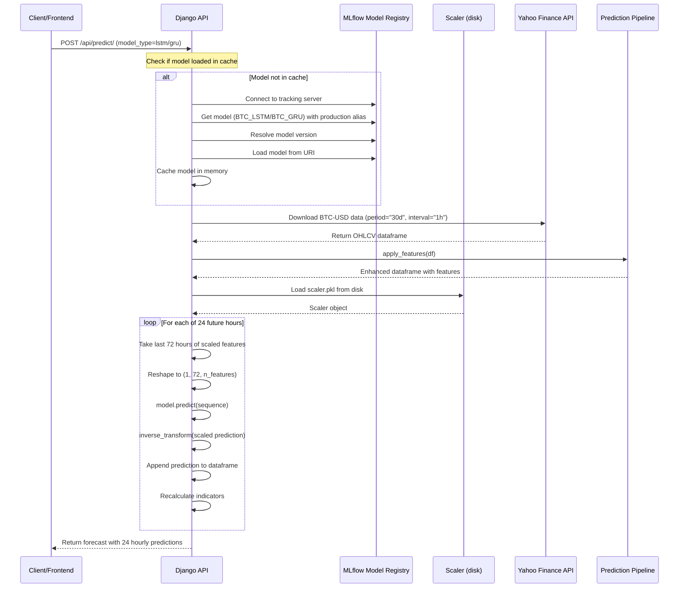
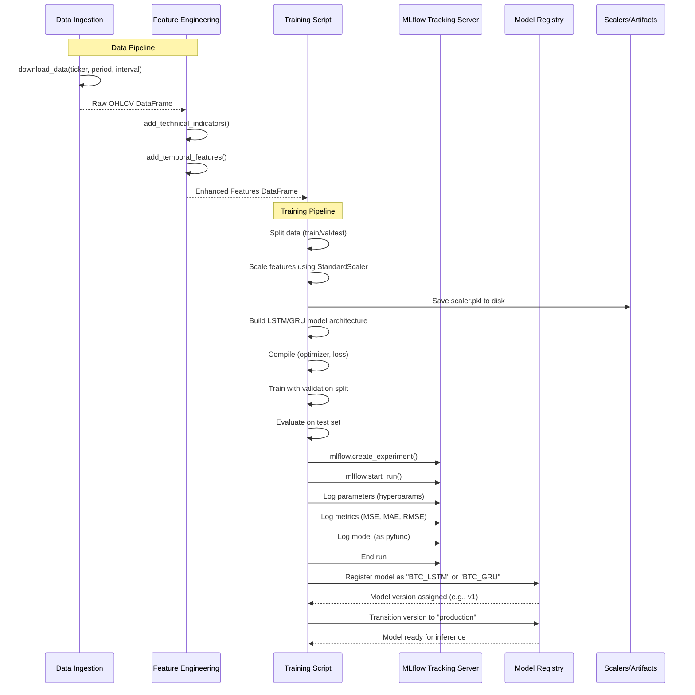
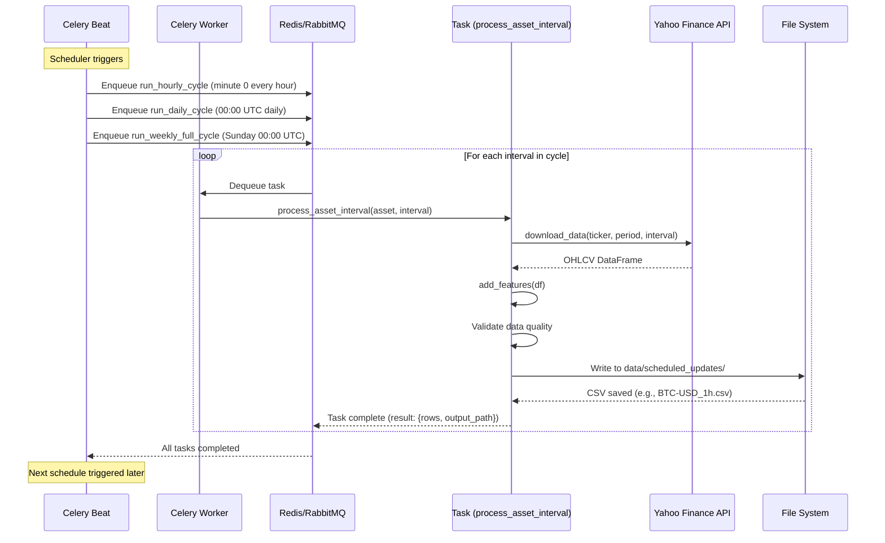
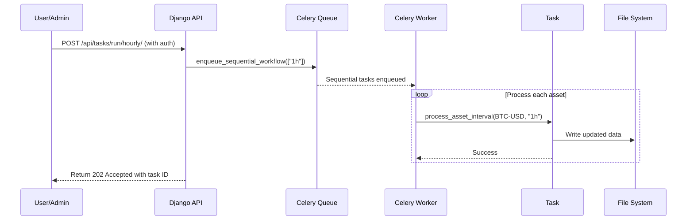
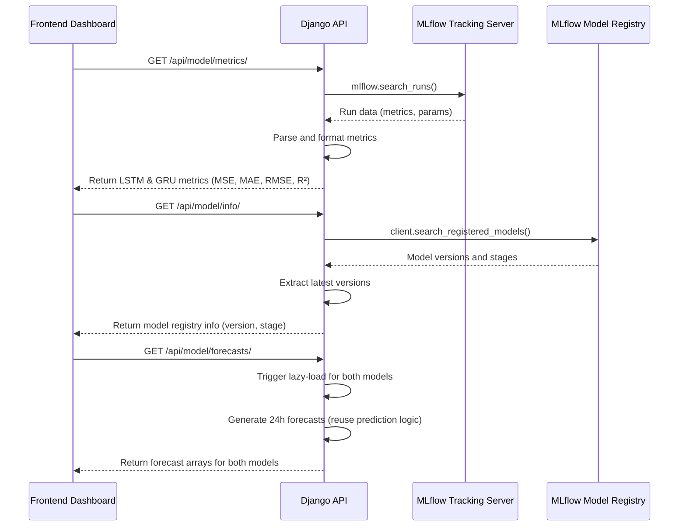

# BTC Forecasting System - Sequence Diagrams

This document provides sequence diagrams showing the flow of interactions between different components of the BTC forecasting system.

## Table of Contents

1. [Prediction API Flow](#prediction-api-flow)
2. [Model Training Flow](#model-training-flow)
3. [Scheduled Data Update Flow](#scheduled-data-update-flow)
4. [Model Metrics Retrieval Flow](#model-metrics-retrieval-flow)

---

## Prediction API Flow

This diagram shows the complete flow when a client requests a BTC price prediction via the `/api/predict/` endpoint.



**Key Steps:**
1. **Lazy Model Loading**: Model loaded on first request and cached
2. **Data Ingestion**: Fetch last 30 days of hourly data from yfinance
3. **Feature Engineering**: Add RSI, SMA, volatility, momentum
4. **Iterative Prediction**: 24-hour iterative forecasting with feature recalculation
5. **Response**: Return forecast with timestamps and prices

---

## Model Training Flow

This diagram illustrates the process of training and registering a new model in MLflow.



**Key Steps:**
1. **Data Collection**: Ingest historical BTC data using yfinance
2. **Feature Engineering**: Add technical indicators and temporal features
3. **Training**: Train LSTM/GRU model with early stopping
4. **MLflow Logging**: Track experiments, parameters, metrics, and model artifacts
5. **Model Registration**: Register model in MLflow Model Registry
6. **Production Deployment**: Transition to production stage

---

## Scheduled Data Update Flow

This diagram shows how Celery automatically updates BTC data at scheduled intervals.



**Alternative: Manual Trigger via API**



**Key Steps:**
1. **Scheduler**: Celery Beat triggers tasks at configured intervals
2. **Queue**: Tasks pushed to Redis/RabbitMQ
3. **Worker**: Processes tasks sequentially
4. **Data Download**: Fetch latest BTC data from yfinance
5. **Storage**: Save processed data to CSV files
6. **Manual Trigger**: Admin endpoints allow on-demand updates

---

## Model Metrics Retrieval Flow

This diagram shows how the frontend retrieves model metrics and forecasts for display.



**Key Steps:**
1. **Metrics**: Query MLflow for latest run metrics
2. **Model Info**: Check MLflow Model Registry for version and stage info
3. **Forecasts**: Generate fresh predictions using cached models
4. **Dashboard**: Frontend displays all information together

---

## Component Overview

### Architecture Layers

```
┌─────────────────────────────────────────────────────────────┐
│                       Frontend (Vue.js)                     │
│  Dashboard | Charts | Prediction Display | Admin Controls  │
└──────────────────────────────┬──────────────────────────────┘
                               │ REST API (HTTPS/JSON)
┌──────────────────────────────▼──────────────────────────────┐
│                  Django REST Backend                        │
│  ┌────────────┐  ┌────────────┐  ┌────────────────────┐   │
│  │ Prediction │  │ Model      │  │ Task Triggers      │   │
│  │ Views      │  │ Metrics    │  │ (Celery)           │   │
│  └────────────┘  └────────────┘  └────────────────────┘   │
└──────────────┬─────────────────┬────────────────────────────┘
               │                 │
    ┌──────────▼─────┐ ┌────────▼──────────┐
    │   MLflow       │ │  Celery Beat      │
    │   Model        │ │  + Worker         │
    │   Registry     │ │  (Redis/RabbitMQ) │
    └────────────────┘ └───────────────────┘
               │                 │
               └─────────────────┘
                       │
          ┌────────────▼────────────┐
          │    ML Pipeline          │
          │  • Training Scripts     │
          │  • Preprocessing        │
          │  • Feature Engineering  │
          └─────────────────────────┘
```

### Technology Stack

| Component | Technology | Purpose |
|-----------|------------|---------|
| **Frontend** | Vue.js + Vite | Interactive dashboard and visualization |
| **Backend** | Django REST Framework | API server and business logic |
| **ML Framework** | TensorFlow/Keras | LSTM & GRU model architectures |
| **Model Management** | MLflow | Experiment tracking, model registry, serving |
| **Task Queue** | Celery + Redis/RabbitMQ | Scheduled data processing |
| **Data Source** | Yahoo Finance API | Live BTC-USD OHLCV data |
| **Storage** | CSV files + MLflow artifacts | Data persistence and model storage |
| **Deployment** | GitHub Actions | CI/CD pipeline |

---

## Data Flow Summary

### Real-time Prediction Path

```
Client Request
    ↓
Django API (Lazy model load)
    ↓
Download latest BTC data (yfinance)
    ↓
Feature engineering (RSI, SMA, etc.)
    ↓
Scale with saved scaler
    ↓
Generate 72-hour sequence window
    ↓
Predict next hour (iterate 24x)
    ↓
Inverse transform predictions
    ↓
Return JSON response
```

### Training Path

```
Historical data download
    ↓
Feature engineering + scaling
    ↓
Train LSTM/GRU model
    ↓
Evaluate metrics (MSE, MAE, RMSE, R²)
    ↓
Log to MLflow tracking
    ↓
Register model in MLflow
    ↓
Transition to production stage
```

### Scheduled Update Path

```
Celery Beat (cron-like)
    ↓
Enqueue download tasks
    ↓
Celery Worker executes
    ↓
Download fresh BTC data
    ↓
Process and save to CSV
    ↓
Updated data ready for predictions
```

---

## Extension Points

To add support for new cryptocurrencies:
1. Update `PIPELINE_ASSETS` environment variable (e.g., `BTC-USD,ETH-USD`)
2. Models trained per asset (different registered models)
3. Celery tasks iterate over all configured assets

To add new technical indicators:
1. Modify `ml_pipeline/features/technical_indicators.py`
2. Retrain models with new feature set
3. Update feature list in `views.py` to match new indicator columns

To change prediction horizon:
1. Modify `future_hours = 24` in `PredictAPIView.post()`
2. Consider retraining with different target sequences
